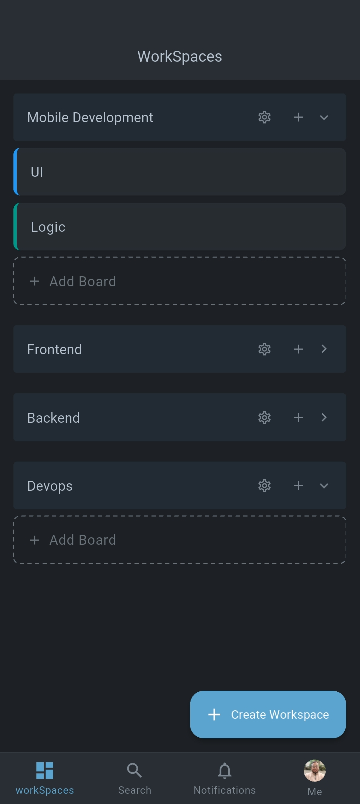
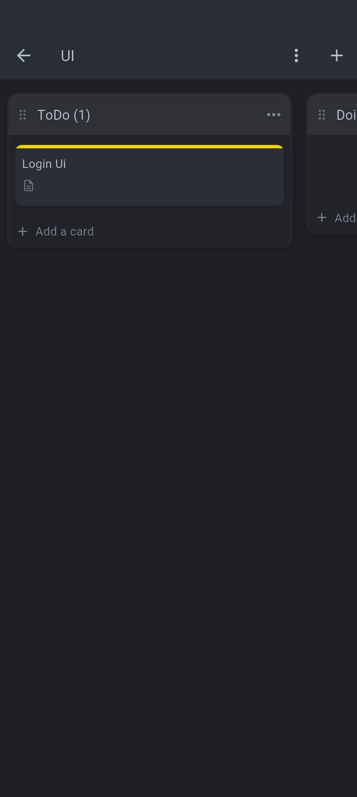
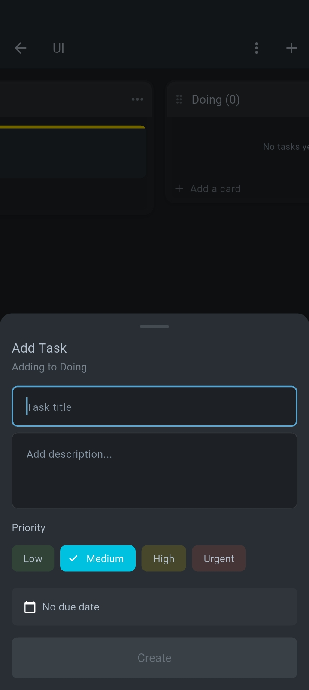
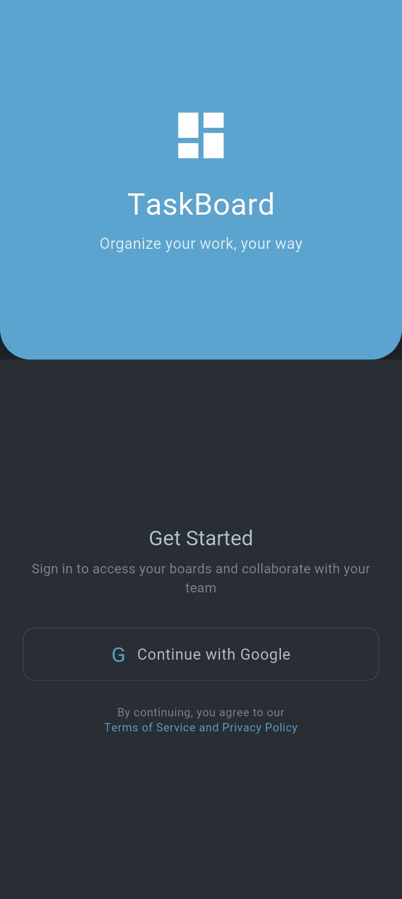
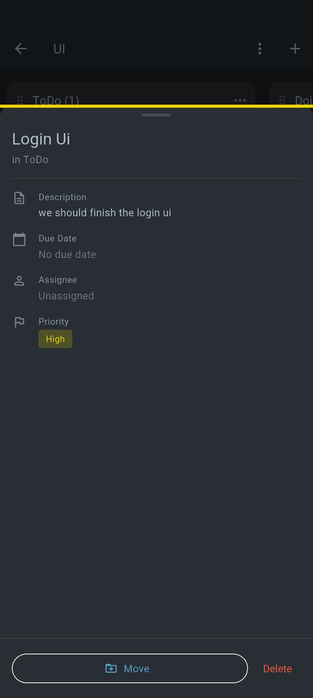
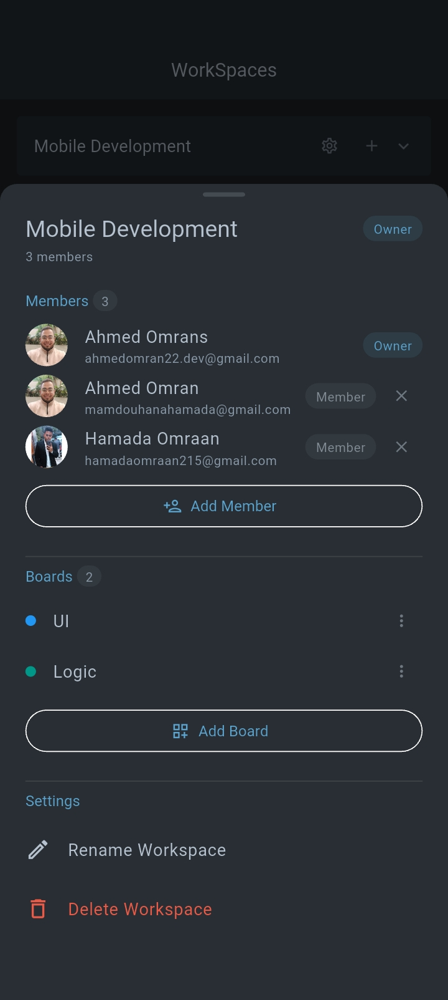
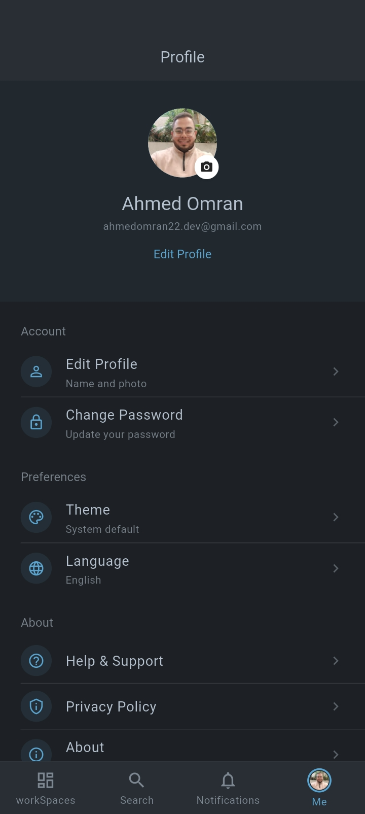
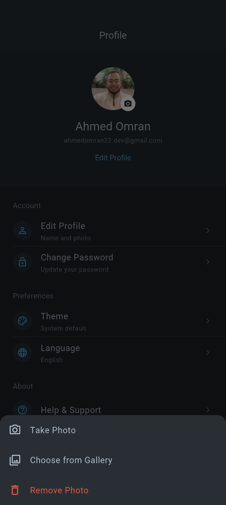

<div align="center">

# Trello Clone

**A Trello-style Kanban app for teams: workspaces, boards, drag-and-drop tasks and real-time sync.**

<sub>Ships in-app as <b>TaskBoard</b></sub>


<br>


&nbsp;

&nbsp;


<!-- Drop a screen recording of drag & drop at assets/screenshots/demo-drag-drop.gif and swap it in here:

-->

</div>

<br>

Built to be more than a UI clone. Each feature follows Clean Architecture, the board is a single Bloc that merges two live Supabase streams with optimistic updates, authorization is enforced by Row Level Security rather than app code, and every merge to `development` is built and shipped to testers automatically. Sign-in is Google-only; Android is the primary target.

[Features](#features) · [Screenshots](#screenshots) · [Tech stack](#tech-stack) · [Architecture](#architecture) · [Decisions](#key-technical-decisions) · [Database](#database-schema) · [CI/CD](#cicd-pipeline) · [Getting started](#getting-started) · [Roadmap](#roadmap)

---

## Features

**Accounts & profile**
- ✅ Google sign-in through Supabase OAuth; the session is restored on cold start and the router redirects on session state
- ✅ Profile: edit your name, upload / replace / remove an avatar (Supabase Storage, camera or gallery), light / dark / system theme that persists

**Workspaces & boards**
- ✅ Workspace create / rename / delete with owner and member roles
- ✅ Member management: add an existing user by email, remove members
- ✅ Board create / rename / delete inside a workspace

**Board screen**
- ✅ Swipeable columns that snap into place, with the neighbouring column peeking so cards can be dragged across
- ✅ Column create / rename / reorder / delete
- ✅ Tasks with title, description, priority (low → urgent) and due date, shown as priority-coloured cards
- ✅ Long-press drag & drop to reorder within a column or move across columns, plus a "Move to" sheet as a fallback
- ✅ **Real-time sync**: every member sees changes instantly (Supabase Realtime on `board_columns` and `tasks`)
- ✅ **Optimistic UI with rollback**: changes appear immediately and revert if the request fails
- ✅ Offline-aware: a "no internet" state with Retry when a board can't load, and a snackbar when a create fails

**Delivery**
- ✅ CI/CD: GitHub Actions → Fastlane → Firebase App Distribution on every push to `development`

> 🚧 **In progress:** notifications UI (the realtime data layer and cubit are built), search, and task editing / assignee picker. Assignees are modelled end to end and rendered on cards; the Bloc and use cases already support editing. The UI for both is what's missing.

## Screenshots

<table>
  <tr>
    <td align="center"><br><sub><b>Google sign-in</b></sub></td>
    <td align="center"><br><sub><b>Workspaces and their boards</b></sub></td>
  </tr>
  <tr>
    <td align="center"><br><sub><b>Board with swipeable columns</b></sub></td>
    <td align="center"><br><sub><b>Task details, move or delete</b></sub></td>
  </tr>
  <tr>
    <td align="center"><br><sub><b>Task creation</b></sub></td>
    <td align="center"><br><sub><b>Workspace settings and members</b></sub></td>
  </tr>
  <tr>
    <td align="center"><br><sub><b>Profile and preferences</b></sub></td>
    <td align="center"><br><sub><b>Avatar upload options</b></sub></td>
  </tr>
</table>

## Tech stack

| Technology | Role | Why |
|---|---|---|
| **Flutter 3.47 / Dart 3.13** | UI and language | One codebase; Dart 3 sealed classes give exhaustive Bloc states and events; Material 3 light and dark themes |
| **Supabase** | Auth, Postgres, Realtime, Storage | The domain is relational (workspace → board → column → task). RLS moves authorization into the database, and realtime and file storage come built in |
| **Supabase OAuth (Google)** | Sign-in | Browser flow with a `com.omran.trello.clone://login-callback` deep link, so there is no native Google SDK to configure |
| **flutter_bloc** | State management | `Bloc` for the board (12 events, two live streams); `Cubit` for CRUD-style features |
| **go_router** | Navigation | Declarative routes; the auth redirect is driven by `SessionCubit` through `refreshListenable` |
| **get_it** | Dependency injection | Explicit wiring in one file, no code generation (no `injectable`). Lazy singletons for datasources, repos and use cases, factories for cubits, `registerFactoryParam` for the per-board `BoardBloc` |
| **equatable** | Value equality | States and entities compare by value, so identical emissions don't rebuild the UI |
| **image_picker, shared_preferences** | Avatar picking, theme persistence | Camera and gallery access; the saved theme is loaded before the first frame |
| **Fastlane, GitHub Actions, Firebase App Distribution** | Delivery | Every merge to `development` reaches testers without manual steps |

## Architecture

🏗️ Feature-first Clean Architecture: every feature owns its `data → domain → presentation` slice, and shared plumbing lives in `core/`.

```
lib/
├── app/          app.dart (providers, theme mode), router.dart (auth redirect), splash
├── core/         constants · di · errors · services · session · theme · utils
└── features/
    ├── auth/           data → domain → presentation
    ├── workspace/      workspaces, members, board list
    ├── boards/         columns, tasks, drag & drop, realtime
    ├── profile/        edit profile, avatar, theme selector
    ├── notifications/  data layer + cubit (UI in progress)
    ├── navbar/         bottom navigation shell
    └── search/         placeholder
```

<details>
<summary><b>Full folder structure</b></summary>

```
lib/
├── app/
│   ├── app.dart                    MultiBlocProvider (Session, Theme, Profile) + MaterialApp.router
│   ├── router.dart                 GoRouter + redirect from SessionCubit state
│   └── splash_screen.dart
├── core/
│   ├── constants/                  app_colors, route_names, supabase_tables, supabase_constants, context_extensions
│   ├── di/di_container.dart        GetIt wiring, one _initX() per feature
│   ├── errors/                     exceptions (data layer) + failures (domain layer)
│   ├── services/                   SupabaseServices: thin CRUD wrapper over the client
│   ├── session/                    SessionCubit: who is signed in, app-wide
│   ├── theme/                      AppTheme (Material 3 light/dark), ThemeCubit
│   └── utils/                      Result<T>, GoRouter refresh stream, validators
└── features/
    ├── auth/
    │   ├── data/                   datasource (Supabase OAuth), UserModel, repo impl
    │   ├── domain/                 UserEntity, AuthRepository, login / logout / get-current-user use cases
    │   └── presentation/           AuthCubit, LoginScreen
    ├── workspace/
    │   ├── data/                   datasource, workspace + member models, repo impl
    │   ├── domain/                 entities, repo interface, create / update / delete / get / add-member / remove-member
    │   └── presentation/           WorkspaceCubit, screen, workspace / board / member widgets
    ├── boards/
    │   ├── data/                   datasource (queries + realtime streams), board / column / task models, repo impl
    │   ├── domain/                 entities, BoardRepo, 13 use cases
    │   └── presentation/           BoardBloc (events, states), BoardCubit (board list), BoardScreen, sheets, draggable cards
    ├── profile/
    │   ├── data/                   datasource (profiles table + Storage), repo impl
    │   ├── domain/                 ProfileRepo, update-profile + upload-avatar use cases
    │   └── presentation/           ProfileCubit, ProfileScreen, edit / theme sheets
    ├── notifications/              datasource (realtime stream), model, entity, repo, cubit
    ├── navbar/                     NavbarScreen + custom bottom bar
    └── search/                     placeholder screen
```

</details>

### The three layers

| Layer | Contains | Talks to |
|---|---|---|
| **Data** | Supabase datasources, JSON models, repository implementations | Supabase (REST, Realtime, Storage). Throws exceptions; repositories convert them to `Failure`s |
| **Domain** | Entities, repository interfaces, use cases (validation and business rules) | Nothing. Pure Dart with no Flutter or Supabase imports |
| **Presentation** | Bloc / Cubit, screens, widgets | Use cases and repository *interfaces* only |

```
Presentation ────────► Domain ◄──────── Data
(Bloc / Cubit,         (entities,       (datasources,
 screens, widgets)      repo interfaces, models,
                        use cases)       repo implementations)
```

Dependencies point inward. `BoardRepositoryImpl` implements `BoardRepo`, and the Bloc only ever sees the interface, so the data layer can be replaced with a fake without touching Bloc or UI code. Use cases carry the rules: trimming and validating names, checking priority values, and re-indexing `position` to a dense `0..n-1` before anything reaches the database.

For the full board walkthrough (data flow per action, the optimistic pattern, the realtime merge and its known race) see [`docs/board_feature_architecture.md`](docs/board_feature_architecture.md).

## Key technical decisions

| Decision | Why | Trade-off |
|---|---|---|
| **Google-only auth** | No passwords to store, reset or verify; one tap to sign in | Requires a Google account. Sign in with Apple is needed for iOS parity (roadmap) |
| **`SessionCubit` separate from `AuthCubit`** | `AuthCubit` lives for one login screen. The session is app-wide state that the router, nav bar and profile all read | Two cubits to keep consistent. `SessionCubit.setUser` is the single write path (login, profile edits) |
| **Bloc for boards, Cubit for the rest** | The board has 12 typed events and two concurrent realtime streams, so an event log makes bad states traceable. CRUD features have one caller and no streams | Two paradigms in one codebase; more boilerplate on the board |
| **One `BoardBloc` for columns and tasks** | Moving a task edits two columns at once. A single owner means one snapshot and one rollback | A large Bloc (~500 lines); the first thing to split if the feature grows |
| **Column metadata and tasks cached separately in the Bloc** | Realtime streams can't join tables, so columns and tasks arrive separately. State is derived by merging `_columnsMeta` and `_tasksByColumn` | A merge on every emit. A realtime snapshot can briefly overwrite an in-flight optimistic move (documented in the board doc) |
| **Workspace-level membership** | One RLS chain: membership → workspace → boards → columns → tasks | No per-board permissions (roadmap) |
| **Optimistic UI with rollback** | Drags and edits feel instant: snapshot, apply, call the server, revert on failure | Created items get a temp id that is swapped for the real one. Only failed creates raise a snackbar; other failures slide back silently |
| **Snap-scrolling columns instead of `PageView`** | Columns are 80% of the screen width, so the neighbouring column peeks and a card can be dropped straight into it. A `PageView` would show one column at a time | Snapping is hand-rolled (`ScrollEndNotification` + `animateTo`) |
| **Drag & drop *and* a "Move to" sheet** | Dropping into a far-away column would need auto-scroll while dragging, so the sheet is the reliable fallback | Two entry points, but one code path: both dispatch the same `TaskMoved` event |
| **Realtime only on `board_columns` and `tasks`** | These change constantly. Workspaces and boards change rarely and are refetched, and every enabled table adds broadcast load. (`notifications` also streams, for the upcoming inbox) | Workspace, board and member lists don't update live |
| **`ON DELETE CASCADE` on all foreign keys** | No orphan rows; the database owns cleanup | Deletes are irreversible. The UI confirms before deleting a workspace, board or column |
| **`position` integer on columns and tasks** | Explicit ordering for drag & drop; `created_at` can't express "insert between". Use cases re-index to `0..n-1` | A reorder writes one row per item (N requests). Fractional indexing or a batch RPC would cut that |
| **Exceptions in the data layer, `Result<T>` across layers** | Repositories turn exceptions into typed failures (`ServerFailure`, `NetworkFailure`, `AuthFailure`), so callers handle failure explicitly. A `SocketException` becomes a friendly "no internet" message | A small hand-rolled `Result` instead of `dartz` / `fpdart` |
| **Profile reuses `UserEntity`; the session is the source of truth** | The user and their profile are the same `profiles` row, so a second entity would only add mapping code. `ProfileCubit` follows `SessionCubit`, and every edit calls `setUser` so name and avatar update everywhere | The auth entity carries every profile field; a richer profile would need its own entity |

## Database schema

Seven tables. `notifications` is the newest, and only its data layer is wired so far.

```
profiles ←→ workspace_members ←→ workspaces → boards → board_columns → tasks
```

- `workspace_members` is the many-to-many join, with a `role` of owner or member
- `tasks.assignee_id` points back to `profiles` (nullable)
- `notifications.user_id` points to `profiles`

<details>
<summary><b>Tables and key columns</b></summary>

| Table | Key columns | Relations |
|---|---|---|
| `profiles` | `id` (same as the auth user id), `email`, `full_name`, `avatar_url`, `created_at`, `updated_at` | 1:1 with `auth.users` |
| `workspaces` | `id`, `name`, `owner_id`, `created_at` | `owner_id` → `profiles` |
| `workspace_members` | `id`, `workspace_id`, `user_id`, `role` | → `workspaces`, → `profiles` |
| `boards` | `id`, `workspace_id`, `name`, `created_at` | → `workspaces` |
| `board_columns` | `id`, `board_id`, `name`, `position`, `created_at` | → `boards` |
| `tasks` | `id`, `column_id`, `title`, `description`, `priority` (low / medium / high / urgent), `position`, `due_date`, `assignee_id`, `created_at` | → `board_columns`, `assignee_id` → `profiles` |
| `notifications` | `id`, `user_id`, `type`, `title`, `body`, `data` (json), `is_read`, `created_at` | → `profiles` |

</details>

**Design notes**
- **RLS on every table.** The client never filters by workspace for authorization. A board is fetched by id, and Postgres decides whether the caller may see it.
- **Cascade deletes** on all foreign keys, so removing a workspace removes its boards, columns and tasks.
- **Triggers** create the `profiles` row when a user signs up and maintain timestamps.
- **One round trip per screen.** The workspace list and a full board load are each a single nested `select` (`workspaces(*, workspace_members(...), boards(*))` and `boards(*, board_columns(*, tasks(*, profiles(...))))`).
- Workspace creation goes through a `create_workspace` Postgres RPC, so ownership is set server-side.

> The schema SQL, RLS policies and triggers currently live in the Supabase project and are not committed to this repo yet (see [Roadmap](#roadmap)).

## CI/CD pipeline

Feature branches (`dev/auth`, `dev/boards`, ...) merge through pull requests into `development`. A push to `development` triggers the pipeline:

```
Push to development
        │
        ▼
GitHub Actions  (ubuntu-latest)
  ├─ checkout · Flutter 3.47.1 (pinned, cached) · flutter pub get
  └─ Ruby 3.4 + Bundler
        │
        ▼
Fastlane   bundle exec fastlane firebase_distribution
  └─ flutter clean → flutter build apk
        │
        ▼
Firebase App Distribution ──► Testers get the new build
```

- Workflow: [`.github/workflows/firebase_distribution.yaml`](.github/workflows/firebase_distribution.yaml). Lane: [`android/fastlane/Fastfile`](android/fastlane/Fastfile).
- Authentication uses a `FIREBASE_TOKEN` repository secret; nothing sensitive is committed.
- Firebase is used only for distribution. The app does not initialise Firebase at runtime yet (FCM is on the roadmap).

## Getting started

**Prerequisites:** Flutter 3.47+ (Dart 3.13), an Android device or emulator, a [Supabase](https://supabase.com) account and a Google Cloud project. Ruby 3.4 and a Firebase project are only needed if you want to reproduce the CI pipeline.

```bash
git clone https://github.com/AhmedOmran22/trello_clone.git
cd trello_clone
```

### 1. Set up Supabase

Create a project, then set up the following (the tables and columns are listed under [Database schema](#database-schema)):

- [ ] The seven tables, with `ON DELETE CASCADE` foreign keys
- [ ] A trigger on `auth.users` that inserts a `profiles` row (the app reads the profile right after sign-in)
- [ ] A `create_workspace(workspace_name text)` function that creates the workspace and its owner membership, and returns the workspace row
- [ ] **RLS enabled on every table**, with policies scoped by workspace membership
- [ ] **Realtime** enabled for `board_columns` and `tasks` (and `notifications`)
- [ ] A **public** Storage bucket named `avatars`, with policies that let a user write only under their own `{user_id}/` folder (insert and update, since avatars are uploaded with `upsert`)

### 2. Set up Google OAuth

1. Google Cloud Console → APIs & Services → Credentials → create an **OAuth client ID** (type *Web application*). Add `https://<PROJECT_REF>.supabase.co/auth/v1/callback` as an authorized redirect URI.
2. Supabase → Authentication → Providers → **Google**: enable it and paste the client ID and secret.
3. Supabase → Authentication → URL Configuration → add `com.omran.trello.clone://login-callback/` to the redirect URLs.

If you change the application id, update it in the `AndroidManifest.xml` intent filter and in `auth_supabase_datasource.dart` too.

### 3. Configure the app

There is no `.env` file. Set your project's values in [`lib/core/constants/supabase_constants.dart`](lib/core/constants/supabase_constants.dart):

```dart
static const String apiUrl = 'https://<PROJECT_REF>.supabase.co';
static const String publishableKey = '<your publishable / anon key>';
```

The publishable key is designed to ship inside a client app; RLS is what protects the data. Never put the `service_role` key in the app.

### 4. Run

```bash
flutter pub get
flutter run
```

> **Platform note:** Android is the tested target. For iOS, the OAuth callback also needs the `com.omran.trello.clone` URL scheme added to `Info.plist`.

## Roadmap

- [ ] Hive caching + offline support
- [ ] Sign in with Apple
- [ ] Board-level permissions
- [ ] Push notifications (FCM)
- [ ] Task comments & attachments
- [ ] Search and filtering
- [ ] Invitation system (accept / reject). Today, members are added directly by email.
- [ ] Notifications UI (realtime data layer already built)
- [ ] Task editing and assignee picker in the UI
- [ ] Commit the schema, RLS policies and triggers as `supabase/migrations`

---

<div align="center">
<sub>Built by <a href="https://github.com/AhmedOmran22">Ahmed Omran</a></sub>
</div>
